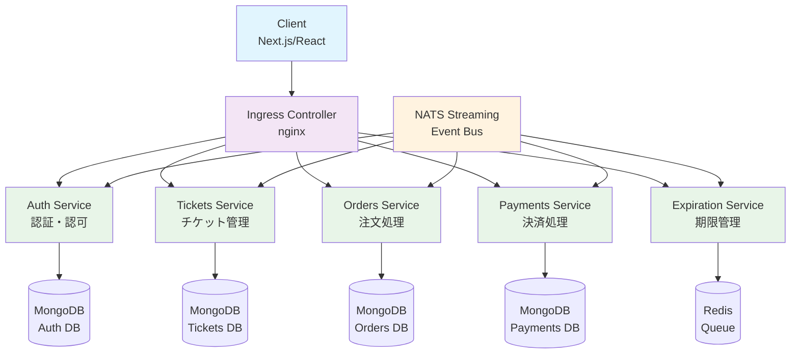
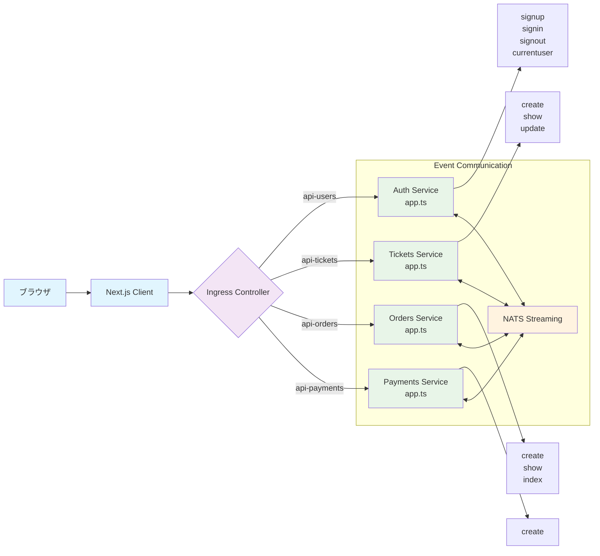
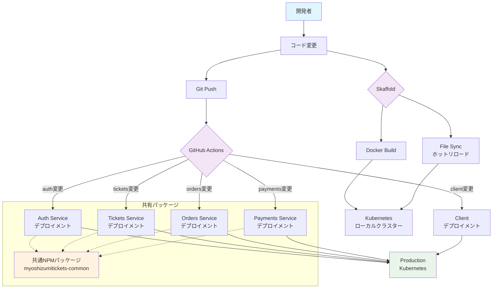

# 概要

## 関連ソースファイル
* `client/pages/index.js`
* `client/pages/tickets/new.js`
* `client/components/header.js`
* `auth/src/app.ts`
* `payments/src/app.ts`
* `orders/src/app.ts`
* `skaffold.yaml`
* `infra/k8s-prod/ingress-srv.yaml`
* `infra/k8s/client-depl.yaml`
* `client/api/build-client.js`
* `client/next.config.js`

## 目的と範囲

この文書では、マイクロサービスベースのチケット販売システムの高レベルな概要を提供し、その主要な目的、アーキテクチャコンポーネント、および技術スタックについて説明します。このシステムにより、ユーザーはイベントチケットの作成、閲覧、購入、販売を、特化されたサービスの分散アーキテクチャを通じて行うことができます。

## システムの目的

このチケット販売システムは、ユーザーが以下を行えるイベントマーケットプレイスです：

* **利用可能なチケットの閲覧** - Webインターフェースを通じて
* **チケットの作成・販売** - 主催するイベント用に
* **チケットの購入** - 統合された決済処理を使用して
* **注文の管理** - 自動有効期限切れと予約処理機能付き

システムは、イベント駆動通信によってサービス間のデータ整合性を保証し、並行するチケット購入を安全に処理し、高トラフィックなチケット販売のためのスケーラブルな基盤を提供します。

**出典:** `client/pages/index.js2-34` `client/pages/tickets/new.js5-57` `client/components/header.js4-10`

## 高レベルアーキテクチャ

システムは、それぞれが特定のドメインを処理する6つのコアサービスを持つマイクロサービスアーキテクチャに従います：

**出典:** `skaffold.yaml11-58` `infra/k8s-prod/ingress-srv.yaml10-47` `infra/k8s/client-depl.yaml4-30`

## サービス対コードアーキテクチャ

この図は、論理サービスを実際のコード実装にマップし、リクエストが特定のルートとハンドラーを通してどのように流れるかを示します：

**出典:** `auth/src/app.ts7-27` `payments/src/app.ts11-26` `orders/src/app.ts10-31` `client/pages/index.js37-39` `client/api/build-client.js3-19`

## 主要技術

システムは、レイヤーごとに整理された最新のクラウドネイティブ技術を活用しています：

| レイヤー | 技術 | 目的 | 主要ファイル |
|---------|------|------|-------------|
| **フロントエンド** | Next.js + React | サーバーサイドレンダリング、ルーティング | `client/pages/*.js` |
| **APIゲートウェイ** | Kubernetes Ingress + nginx | リクエストルーティング、負荷分散 | `infra/k8s*/ingress-srv.yaml` |
| **サービス** | Node.js + Express + TypeScript | マイクロサービス実装 | `*/src/app.ts` |
| **イベント** | NATS Streaming | サービス間非同期通信 | イベントパブリッシャー/リスナー |
| **データ** | MongoDB (サービス毎) | サービス固有のデータ永続化 | サービス固有データベース |
| **キュー** | Redis + Bull | バックグラウンドジョブ処理 | 期限管理サービス |
| **オーケストレーション** | Kubernetes | コンテナ管理、スケーリング | `infra/k8s/*.yaml` |
| **開発** | Skaffold + Docker | ローカル開発、ホットリロード | `skaffold.yaml` |

**出典:** `client/next.config.js1-6` `skaffold.yaml1-60` `infra/k8s-prod/ingress-srv.yaml1-79`

## 開発・デプロイメントモデル

システムは、マイクロサービス向けに最適化された高度な開発ワークフローを使用します：

開発モデルは以下をサポートします：

* **ホットリロード** - 迅速な反復開発のためのSkaffoldファイル同期を通じて
* **独立デプロイメント** - パスベースのGitHub Actionsトリガーを通じたサービスの独立デプロイメント
* **共有ユーティリティ** - `myoshizumitickets-common` npmパッケージを通じて
* **コンテナオーケストレーション** - 本番環境でのスケーラビリティのためのKubernetesを使用

**出典:** `skaffold.yaml15-58` `auth/src/app.ts11` `payments/src/app.ts10` `orders/src/app.ts9`

この概要は、チケット販売システムのコンポーネントがどのように連携してスケーラブルなイベント駆動マーケットプレイスを提供するかを理解するための基盤を提供します。
